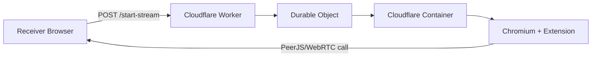

# Stream Kit Architecture

This document is the central map for the repo: what is product code, what is example code, how the Cloudflare deployment works, and where OpenGame System fits in.

## What This Repo Actually Contains

There are two separate layers in this repository:

1. The reusable packages in `packages/`
2. The end-to-end Cloudflare example in `examples/bun-stream-server/`

They are related, but today they are not fully wired together.

## The Reusable Packages

These packages are the SDK layer:

- `packages/stream-kit-types`
  - Shared TypeScript types for sessions, stream state, render options, and events.
- `packages/stream-kit-web`
  - Browser-side client abstractions for requesting a stream session and managing a `RenderStream`.
  - This is the beginnings of a generic browser client SDK.
- `packages/stream-kit-react`
  - React bindings around an existing `RenderStream`.
  - This does not start a Cloudflare container by itself. It renders and subscribes to a stream object.
- `packages/stream-kit-server`
  - Server-side abstractions and a hook-based router for stream state persistence.
  - It also contains a `StreamKitServer` class, but that API is still incomplete and is not what the Cloudflare example uses.
- `packages/stream-kit-testing`
  - Mock clients and test helpers for the package layer.

These packages are the foundation for a future productized SDK, but they are not the deployed runtime that powers the current Cloudflare demo.

## The Cloudflare Example

The real working deployment path today lives in `examples/bun-stream-server/`.

That example is self-contained and includes:

- `examples/bun-stream-server/src/index.ts`
  - The public Cloudflare Worker entrypoint
  - Routes all incoming requests through a single Durable Object instance
  - Starts and proxies a Cloudflare Container
- `examples/bun-stream-server/wrangler.jsonc`
  - Declares the Worker, Durable Object binding, and container image
  - Enables outbound internet for the container deployment path
- `examples/bun-stream-server/container/`
  - The containerized Node/Puppeteer server that runs Chromium
- `examples/bun-stream-server/container/extension/`
  - A Chrome extension that captures the rendered tab and sends it over PeerJS/WebRTC
- `examples/bun-stream-server/receiver.html`
  - A standalone receiver page that opens a PeerJS peer, asks the Worker to start a stream, and displays the remote media

## Current End-to-End Flow

The flow is:

1. The receiver page opens a PeerJS receiver peer in the browser.
2. The receiver page sends `POST /start-stream` to the deployed Worker with:
   - `url`: the website to render
   - `peerId`: the receiver's PeerJS ID
3. The Worker forwards the request into a single Durable Object.
4. The Durable Object ensures a container instance is running.
5. The container launches Chromium and opens the target URL.
6. The Chrome extension captures the target tab.
7. The extension creates a PeerJS sender peer and calls the receiver peer.
8. The receiver answers the call and attaches the returned `MediaStream` to the page.

## Does This Require OpenGame API?

No.

The current example does not call OpenGame API at all. It can be deployed and exercised as its own standalone system.

## How OpenGame Would Integrate

OpenGame is optional orchestration around Stream Kit, not a hard runtime dependency.

The likely integration model is:

1. OpenGame decides when a stream should exist.
2. OpenGame calls your deployed Stream Kit Worker with the page or game URL to render.
3. Stream Kit produces the remote browser stream.
4. OpenGame embeds the receiver UI or uses the package layer to display the stream inside its own app.

In other words:

- OpenGame can own auth, tenancy, sessions, game state, and entitlement.
- Stream Kit can own remote rendering, browser automation, and video delivery.

## Do You Need Your Own Worker?

Yes, for the Cloudflare example path.

The example under `examples/bun-stream-server/` is designed to be deployed as your own Worker + Durable Object + Container stack. It is not a client-only artifact.

You can run it:

- Locally, by running the container server yourself and opening `receiver.html`
- In Cloudflare, by deploying the Worker with Wrangler

## What Works Right Now

We have verified these pieces:

- The Worker deploys successfully.
- The Durable Object comes up.
- The container boots.
- `/health` responds from the deployed environment.
- `/test-puppeteer` successfully launches Chromium with the extension.
- `/start-stream` now returns success from the deployed environment.
- The receiver now receives an incoming PeerJS call from the container.
- The receiver now receives a `MediaStream`.

## What Is Still Broken

The final media leg is still not correct in the deployed Cloudflare environment.

Current observed behavior:

- The browser receives a `MediaStream`
- The call connects
- The `<video>` element gets a stream attached
- But the media never becomes playable data:
  - `readyState` remains `0`
  - `videoWidth` and `videoHeight` remain `0`
  - playback stays in a waiting state

That means the system is now failing at the "captured tab produces real frames" step, not at Worker deploy, container boot, or PeerJS dialing.

## Most Likely Remaining Root Cause

The repo's own README history points at this same problem:

- headless Chromium tab capture inside containerized environments can produce empty or non-playing streams
- previous notes in the example reference virtual-display/Xvfb approaches as the workaround

The current Cloudflare container still uses headless Chromium, so the most likely remaining issue is:

- Chromium/extension tab capture is creating a stream object
- but that stream is not producing real video frames in the Cloudflare runtime

## Practical Mental Model

When thinking about this repo, treat it like this:

- `packages/` = SDK and abstractions
- `examples/bun-stream-server/` = the actual deployed prototype
- OpenGame integration = optional outer orchestration layer

## Recommended Next Steps

1. Keep the Cloudflare example as the truth for end-to-end testing.
2. Treat the package layer as a separate productization effort.
3. Decide whether the production architecture should continue using:
   - Chrome extension + tab capture + PeerJS
   - or a different capture/stream transport strategy better suited to Cloudflare Containers
4. Once the deployed media path is stable, wire the reusable packages to this example instead of maintaining two partially separate architectures.
