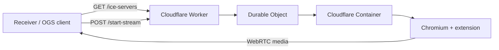

# Stream Kit Architecture

## Repo Shape

This repository currently contains two related but distinct layers:

1. `packages/` — reusable SDK and testing primitives
2. `examples/bun-stream-server/` — the working Cloudflare runtime

The example is the truth for deployed behavior today. The package layer is the productization path.

## Current Working Runtime

The deployed runtime lives in [`examples/bun-stream-server/`](../examples/bun-stream-server).

Main pieces:

- [`src/index.ts`](../examples/bun-stream-server/src/index.ts): Worker entrypoint, TURN minting, session routing, DO proxying
- [`container/src/server.ts`](../examples/bun-stream-server/container/src/server.ts): browser lifecycle and container HTTP server
- [`container/extension/`](../examples/bun-stream-server/container/extension): tab capture and PeerJS sender
- [`receiver.html`](../examples/bun-stream-server/receiver.html): browser receiver used for local and deployed testing

## Deployed Flow

Detailed flow:

1. The receiver creates a session-scoped ID and PeerJS receiver peer.
2. The receiver asks the Worker for Cloudflare TURN credentials.
3. The receiver posts `/start-stream` with the target URL, receiver peer ID, and session header.
4. The Worker routes that request to a session-scoped Durable Object.
5. The Durable Object starts or reuses a container for that session.
6. The container launches Chromium, loads the target page, and captures the tab through the extension.
7. The extension creates a sender peer and calls the receiver using the same ICE configuration.
8. The receiver attaches the returned media to the page and plays the stream.

## OGS Product Direction

The intended product architecture is different from the standalone example:

- `opengame-app` owns native app UX and cast picker integration.
- `app-bridge` is the transport between the WebView game and the native app.
- `stream-kit` should expose the game-developer-facing SDK and hide most `app-bridge` details.
- `opengame-api` should expose public stream and cast session APIs.
- OGS-owned Cloudflare infrastructure should run the actual streaming runtime.

## Boundary Recommendation

### `stream-kit`

Should own:

- client SDK primitives
- stream session client behavior
- React components/hooks
- app-bridge integration adapters
- streaming runtime implementation

Should not be the public place where third-party developers manage infrastructure.

### `opengame-api`

Should own:

- authenticated public API
- developer/game authorization
- entitlement and quota checks
- stream or cast session lifecycle endpoints
- usage accounting and audit trails

### `opengame-app`

Should own:

- native cast UI
- session UX
- native capability bridging

## Near-Term Reality

- The deployed example works.
- The package API is not yet the polished OGS SDK shape.
- The internal architecture is now good enough to power a productized API, but that public API still needs to be designed and implemented.
